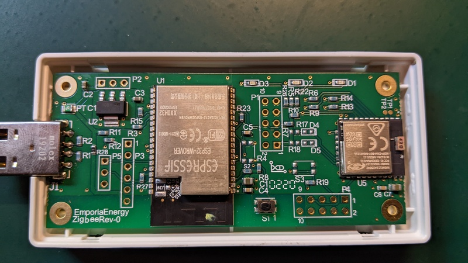

## Pinouts

### P1

JTAG header for the ESP32 module.  The pinout is the same as as the [ESP-Prog](https://docs.espressif.com/projects/espressif-esp-iot-solution/en/latest/hw-reference/ESP-Prog_guide.html)

| Pin | ESP Pin | ESP Port | Description |
| --- | ------- | -------- | ----------- |
|  1  |         |          |      +3v3   |
|  2  |    13   |  GPIO14  |   JTAG TMS  |
|  3  |         |          |        GND  |
|  4  |    16   |  GPIO13  |   JTAG TCK  |
|  5  |         |          |        GND  |
|  6  |    23   |  GPIO15  |   JTAG TDO  |
|  7  |         |          |        GND  |
|  8  |    14   |  GPIO12  |   JTAG TDI  |
|  9  |         |          |        GND  |
| 10  |     3   |          |         EN  |

### P2

Power supply 

| Pin | Description |
| --- | ----------- |
|  1  |        +5v  |
|  2  |       +3v3  |
|  3  |        GND  |

### P3

ESP32 Serial programming interface.  Note that pin 6 is 5 volt, not 3.3 volt.

| Pin | ESP Pin | ESP Port |
| --- | ------- | -------- |
|  1  |    25   |   GPIO0  |
|  2  |     3   |      EN  |
|  3  |         |     GND  |
|  4  |    35   |      TX  |
|  5  |    34   |      RX  |
|  6  |         |     +5v  |

### P4

JTAG interface to the MGM111 module

### P5

| Pin | ESP Pin | MGM111 Pin | Description |
| --- | ------- | ---------- | ----------- |
|  1  |  GPIO21 |            |    ESP RX   |
|  2  |  GPIO22 |            |    ESP TX   |
|  3  |         |            |       GND   |
